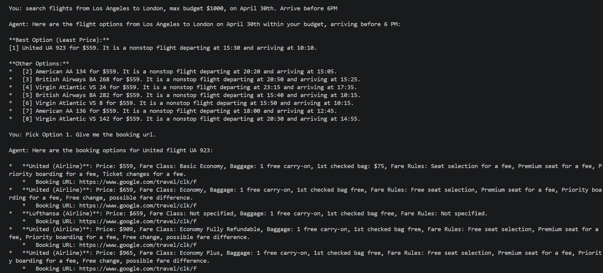

# Flight Agent

An AI-powered flight search agent built with Python, FastMCP, and Google Gemini. The agent helps users find one-way international flights by handling natural language queries, multi-airport cities, flexible dates, and flight filtering.

## Features

- Natural language flight search (e.g. "flights from Tokyo to LA around June 30th, under $800")
- Automatic city-to-airport resolution (e.g. "Tokyo" → HND, NRT)
- Flexible date search: exact date, date range, or ±N days buffer
- Parallel API calls for multi-date searches with 30-minute result caching
- Filtering: budget, stops, departure/arrival time windows, airline preferences
- Flight recommendations with notices (best choice, least price, tight connection, etc.)
- Booking options retrieval via SerpAPI

## Architecture

```
main.py
└── agent/planner_gemini.py       # Gemini agent loop (multi-turn chat)
    └── mcp_server/server.py      # FastMCP server
        ├── tools/resolve_airports.py        # City → IATA codes
        ├── tools/search_flight_workflow.py  # Date expansion + flight search + caching
        └── tools/get_booking_options.py     # Booking options retrieval
    └── state.py                  # In-session shared state (flight store, token map)
```

## Setup

**1. Clone and create environment**
```bash
conda create -n flight-agent python=3.11
conda activate flight-agent
pip install -r requirements.txt
```

**2. Configure API keys**

Copy `.env.example` to `.env` and fill in your keys:
```
ANTHROPIC_API_KEY=your_key_here
GEMINI_API_KEY=your_key_here
SERPAPI_KEY=your_key_here
```

- [Google Gemini API](https://aistudio.google.com/) — LLM provider
- [SerpAPI](https://serpapi.com/) — Google Flights data (100 free searches/month)

**3. Prepare airport data**
```bash
python data/prepare_airports.py
```

**4. Run**
```bash
python main.py
```

## Demo



## Usage

```
Flight Agent
========================================
Type your message and press Enter. Type 'exit' or leave blank to quit.

You: Flights from Dalian to Los Angeles on June 30th, no more than 1 stop, budget $1000
Agent: Here are the available flights...

You: I want option 1, give me the booking link
Agent: Here are booking options for KE 18 / KE 873...
```

## Project Structure

```
flight-agent/
├── agent/
│   ├── planner_gemini.py     # Gemini multi-turn agent
│   └── planner.py            # Claude agent (alternative)
├── config/
│   └── settings.py           # API keys and model config
├── data/
│   ├── city_airport_map.py   # Static city → airport code map
│   └── prepare_airports.py   # One-time airport CSV preparation
├── devdocs/                  # Design documents
├── mcp_server/
│   ├── server.py             # FastMCP server entry point
│   ├── state.py              # Shared in-session state
│   └── tools/
│       ├── resolve_airports.py
│       ├── search_flight_workflow.py
│       ├── get_booking_options.py
│       ├── flexible_dates.py      # (utility, not registered as MCP tool)
│       └── search_flights.py      # (utility, not registered as MCP tool)
├── main.py
└── requirements.txt
```

## Limitations

- One-way flights only (round-trip and multi-city not yet supported)
- SerpAPI free tier: 100 searches/month
- In-memory session state only (resets on restart)
- Booking requires opening the link in a browser to complete on Google Flights
